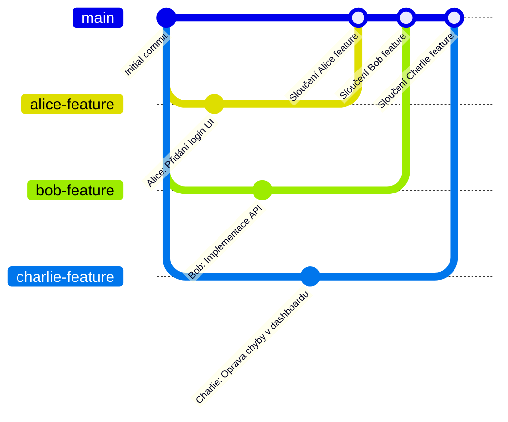
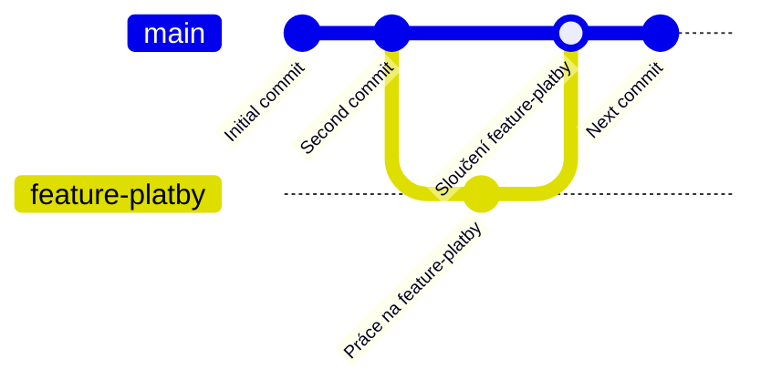
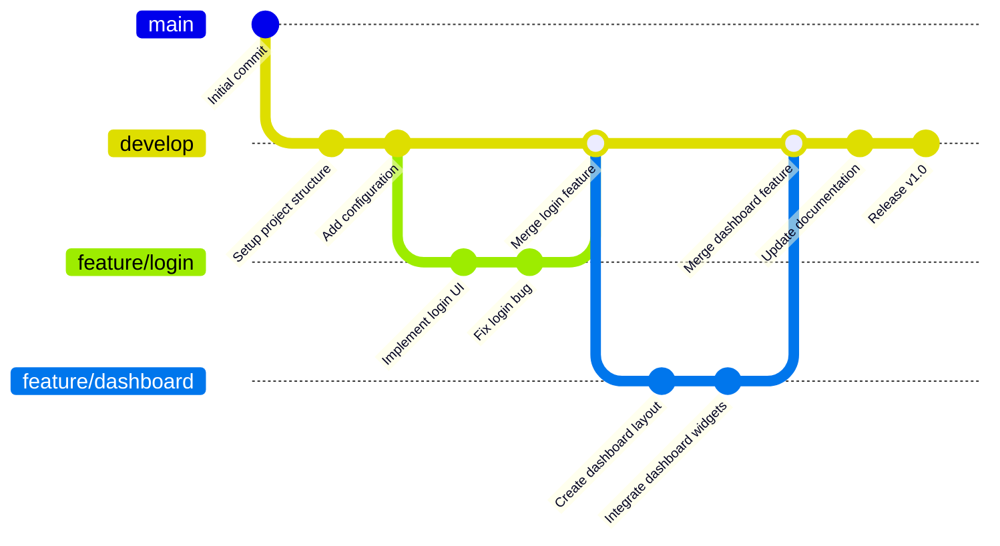

---
#== Layout
theme: default
background: https://cover.sli.dev # https://unsplash.com/collections/94734566/slidev
transition: slide-left #https://sli.dev/guide/animations#slide-transitions
mdc: true # https://sli.dev/guide/syntax#mdc-syntax
selectable: false
codeCopy: false
download: true
hideInToc: true

#== Code Highlighter
highlighter: shiki
lineNumbers: true

#== Dravings https://sli.dev/guide/drawing
drawings:
  persist: false

#== Export Configuration
# use export CLI options in camelCase format https://sli.dev/guide/exporting.html
export:
  format: pdf
  timeout: 30000
  dark: false
  withClicks: false

#== Slide Info
src: '../../pages/index.md'
title: "GIT pro pokročilé"
exportFilename: "36_git_pokrocile"
titleTemplate: "SCM %s by Adam Fišer"
info: |
  ## PVA2 Programování a vývoj aplikací

  Určeno pouze pro výukové účely

  [Repository](https://github.com/oa-scm-syllabus/scm_prednasky) / [Prezentace](https://oa-scm-syllabus.github.io/scm/)

  Created by [Adam Fišer](https://github.com/AdamFiser)
---
layout: default
---

#  Obsah

<Toc :columns="2" minDepth="1" maxDepth="1"></Toc>
---

# Úvod

- Pochopit význam větvení (branches) v Gitu
- Naučit se vytvářet a spravovat větve
- Seznámit se s příkazem `merge`
- Naučit se pracovat s `pull` a `pull request`
- Pochopit základní principy týmové práce s GitHubem

---

# Opakování základů GITu

> Git je distribuovaný systém pro správu verzí, který umožňuje sledovat změny v kódu a efektivně spolupracovat na projektech.  


### Základní příkazy
- `git init` – vytvoření nového repozitáře
- `git clone <url>` – klonování existujícího repozitáře
- `git add <soubor>` – přidání souboru ke commitu
- `git commit -m "Popis změny"` – uložení změn do historie
- `git push origin <větev>` – odeslání změn na vzdálený repozitář
- `git pull origin <větev>` – stažení a sloučení změn ze vzdáleného repozitáře

---
layout: image-right
image: https://cover.sli.dev
---

# GitHub Issues

---

# Co jsou Issues?

Issues jsou nástrojem pro sledování úkolů, chyb a požadavků v rámci projektu. Každý Issue obsahuje popis problému, komentáře, štítky, přiřazené osoby a další metadata. Issues jsou klíčovým prvkem pro správu projektů a komunikaci v týmu.

## Proč používat Issues?

- Sledování úkolů – Issues umožňují vytvářet, přiřazovat a sledovat úkoly v rámci projektu.
- Diskuze a komentáře – členové týmu mohou diskutovat, přidávat komentáře a navrhovat řešení.
- Prioritizace úkolů – Issues lze označit štítky, přiřadit prioritu a přiřadit kategorii.
- Integrace s Pull Requesty – Issues lze propojit s Pull Requesty a sledovat, které změny řeší daný problém.
- Historie změn – každý Issue uchovává záznam o změnách, komentářích a řešení.
- Otevřenost a transparentnost – Issues jsou veřejné a umožňují zapojit komunitu do řešení problémů.

---

# Jak fungují Issues?

- Vytváření Issues – Každý člen týmu může vytvořit issue k hlášení chyby, požadavku na funkci nebo dokumentaci.
- Přiřazování – Issues lze přiřadit konkrétním členům týmu, kteří jsou zodpovědní za jejich řešení.
- Tagování (Labels) – Možnost přidávat štítky jako bug, enhancement, question pro snadnější organizaci.
- Milestones – Lze seskupit Issues do milníků pro sledování pokroku větších úkolů.
- Diskuze a komentáře – Každý Issue umožňuje komentování, zpětnou vazbu a odkazy na související kód.
- Uzavření Issues – Jakmile je problém vyřešen, Issue se uzavře, což zlepšuje přehlednost projektu.

---

# Jak vytvořit Issue?

1. Přejděte do záložky **Issues** v repozitáři.
2. Klikněte na tlačítko **New Issue**.
3. Zadejte název a popis problému.
4. Přiřaďte Issue kategorii, štítky a přiřaďte osobu.
5. Klikněte na tlačítko **Submit new issue**.

---

# Řešení Issues

Vždy pracujeme s konkrétním Issue, které obsahuje popis problému, komentáře a metadata. Jeho identifikátor je unikátní a lze ho použít k odkazování v Pull Requestech a komentářích.

1. **Přiřazení Issue** – Každý Issue by měl být přiřazen konkrétní osobě, která je zodpovědná za jeho řešení.
2. **Diskuze a komentáře** – Členové týmu mohou přidávat komentáře, diskutovat a navrhovat řešení.
3. **Pull request** Po dokončení vytvoříte Pull Request s odkazem na Issue (`Fix #123`).
4. **Schválení** - Po schválení Pull Requestu se Issue automaticky uzavře.


---
layout: image-right
image: https://cover.sli.dev
---

# Větvení v GITu

---

# Co jsou větve?

- Větve v Gitu umožňují pracovat na různých verzích kódu současně, aniž byste ovlivnili hlavní větev projektu. Každá větev je v podstatě samostatná pracovní kopie repozitáře, kde můžete provádět změny, aniž byste ovlivnili hlavní (produkční) kód.

## Hlavní větev (main nebo master)
- Každý Git repozitář má hlavní větev (main nebo master), která obsahuje stabilní a produkční verzi kódu. Do této větve by se měly dostávat pouze ověřené a otestované změny prostřednictvím merge nebo pull requestů.


---

# Proč používat větve?

- Paralelní vývoj – více lidí může pracovat na různých funkcionalitách současně.
- Bezpečnost – změny jsou izolované a neovlivňují hlavní větev (main nebo master).
- Snadná správa verzí – můžete experimentovat s novými funkcemi bez rizika poškození hlavního kódu.
- Týmová spolupráce – každý vývojář může pracovat na své větvi a následně ji spojit s hlavním projektem pomocí pull requestů.



---

# Příklad použití větví

Představte si, že pracujete na e-shopu a potřebujete přidat novou platební metodu. Místo toho, abyste prováděli změny přímo v hlavní větvi (main), vytvoříte novou větev feature-platby. V této větvi provedete změny a až budete hotovi, sloučíte ji zpět do main.

Dalším příkladem může být oprava chyby v kódu. Místo toho, abyste opravu prováděli přímo v hlavní větvi, vytvoříte novou větev bugfix-chyba, provedete změny a sloučíte je zpět do main.

Při vývoji nové verze aplikace, pracujete na nové funkci. Avšak během vývoje musíte opravit závažnou chybu v produkční verzi. Vytvoříte novou větev pro opravu chyby, provedete změny a sloučíte je zpět do main. Nedokončená funkce zůstane na své větvi a bude dokončena později. 

---
layout: two-cols-header
---

# Příklad větvení v GITu

Diagram ukazuje:
- Vytvoření počátečního commitu.
- Odbočení do nové větve **feature-platby**.
- Commit změn ve větvi **feature-platby**.
- Návrat do větve **main** a sloučení změn z **feature-platby**.

::left::

```shell
# Vytvoření nové větve
$ git branch feature-platby

# Přepnutí do nové větve
$ git checkout feature-platby

# Po dokončení změn
$ git checkout main
$ git merge feature-platby
```

::right::




---
layout: image-right
image: https://cover.sli.dev
---

# Větvení prakticky

---

# Vytvoření větve

| *Aplikace*   | *Postup* |
|--------------|---------------------------------------------------------------------------------------------------------------------------------------------------------------|
| **Terminál** | `git branch nazev-vetve`                                                                                                                                      |
| **PHPStorm** | 1. Otevřete **Git** panel v pravém dolním rohu.<br>2. Klikněte na aktuální větev.<br>3. Vyberte **New Branch...**.<br>4. Zadejte název nové větve a potvrďte. |
| **GitHub**   | 1. Přejděte do repozitáře.<br>2. Otevřete záložku **Branches**.<br>3. Klikněte na **New Branch**, zadejte název a potvrďte.                                   |

---

# Přepnutí mezi větvemi

| *Aplikace*   | *Postup* |
|-----------|---------|
| **Terminál** | `git checkout nazev-vetve` nebo `git switch nazev-vetve` |
| **PHPStorm** | 1. Klikněte na název aktuální větve v pravém dolním rohu.<br>2. Vyberte větev, na kterou se chcete přepnout. |
| **GitHub** | 1. Přejděte do repozitáře.<br>2. Otevřete **Branches**.<br>3. Klikněte na požadovanou větev. |

---

# Spojení větví (Merge)




---

# Spojení větví

| *Aplikace*   | *Postup* |
|-----------|---------|
| **Terminál** | 1. Přepněte se na hlavní větev: `git checkout main`.<br>2. Sloučete změny z jiné větve: `git merge nazev-vetve`. |
| **PHPStorm** | 1. Přepněte se na hlavní větev.<br>2. Otevřete **Git > Branches**.<br>3. Klikněte pravým tlačítkem na větev, kterou chcete sloučit.<br>4. Vyberte **Merge into Current**. |
| **GitHub** | 1. Otevřete **Pull Requests** a vytvořte nový merge request.<br>2. Klikněte na **Merge** po schválení. |

---

## Stahování změn (Pull)

| *Aplikace*   | *Postup* |
|-----------|---------|
| **Terminál** | `git pull origin main` |
| **PHPStorm** | 1. Otevřete **Git > Pull**.<br>2. Vyberte vzdálenou větev (např. `origin/main`).<br>3. Klikněte na **Pull**. |
| **GitHub** | 1. V GitHub repozitáři klikněte na **Fetch and Pull** v záložce kódu. |

---

# Nevýhody větvení a možné problémy

Přestože větve přinášejí mnoho výhod, mohou přinést i určité komplikace:
- **Konflikty při slučování** (merge conflicts) – pokud dva vývojáři upraví stejný soubor na různých větvích, Git nemusí být schopen automaticky sloučit změny.
    - Řešení: Otevřít soubor s konfliktem, ručně upravit změny a potvrdit (`git add`, `git commit`).

- **Příliš mnoho větví** – v některých projektech může přibýt velké množství větví, což může ztížit orientaci.
    - Řešení: Po sloučení změn pravidelně mazat nepotřebné větve (`git branch -d nazev-vetve`).

- **Zastaralé větve** – pokud je větev dlouho neaktualizovaná, může dojít ke komplikacím při sloučení.
    - Řešení: Pravidelně provádět `git pull` nebo rebase (`git rebase main`).

- **Špatná organizace větví** – pokud tým nemá jasná pravidla pro pojmenovávání a používání větví, může dojít ke zmatku.
    - Řešení: Zavést konvenci pro pojmenování větví (např. `feature/jmeno-funkce`, `bugfix/jmeno-chyby`).


---
layout: image-right
image: https://cover.sli.dev
---

# Pull Request (PR)

---

# Co je Pull Request?

Pull Request (PR) je žádost o začlenění změn z jedné větve do jiné, obvykle z vývojové větve do hlavní (main). PR umožňuje kontrolu kódu, diskusi nad změnami a zajišťuje, že nové funkce nebo opravy chyb neovlivní stabilitu projektu.

## Proč používat Pull Requesty?

- Kontrola kódu – ostatní členové týmu mohou revidovat a komentovat navržené změny.
- Zajištění kvality – PR umožňují provádět testy a validace před sloučením do hlavní větve.
- Bezpečnostní kontrolu – umožňují zamezit nechtěným chybám nebo bezpečnostním rizikům.
- Historii změn – každý Pull Request uchovává záznam o tom, kdo změny provedl a proč.

---

# Co můžeme s pull requestem udělat?

- Komentovat a diskutovat změny – každý člen týmu může přidávat komentáře k jednotlivým řádkům kódu.
- Požadovat úpravy – pokud změny nejsou dostatečné, může reviewer požádat autora o úpravy.
- Provádět testy a validace – mnoho projektů využívá automatizované testy, které běží před schválením PR.
- Schválit a sloučit změny – po dokončení kontroly je možné PR sloučit do hlavní větve (main).
- Zavřít PR bez sloučení – pokud se ukáže, že změny nejsou potřebné nebo správné, PR lze zavřít bez sloučení.

---

# Pull request jako součást code review

Code review je proces, kdy ostatní členové týmu kontrolují a hodnotí kód před jeho sloučením do hlavní větve. Pull Requesty jsou klíčovou součástí code review, který umožňuje týmu kontrolovat a schvalovat změny v kódu. Code review je důležitým nástrojem pro zajištění kvality kódu, sdílení know-how a učení se od ostatních.

- Zvýšení kvality kódu – odhalení chyb, nekonzistencí a zlepšení čitelnosti kódu.
- Lepší spolupráci v týmu – umožňuje sdílení znalostí a vylepšení návrhu aplikace.
- Dodržení standardů – pomáhá udržovat konzistentní styl kódování a architekturu.
- Zamezení bezpečnostním chybám – umožňuje identifikaci potenciálních bezpečnostních problémů před nasazením.

---

# Jak probíhá code review?

1. **Vytvoření Pull Requestu** – autor změn vytvoří PR a označí potenciálního recenzenta.
2. **Kontrola změn** – recenzent prochází změny, komentuje a navrhuje úpravy.
3. **Diskuze a úpravy** – autor reaguje na komentáře, provádí úpravy a aktualizuje PR.
4. **Schválení a sloučení** – po schválení recenzentem jsou změny sloučeny do hlavní větve.
5. **Zavření Pull Requestu** – po sloučení změn je PR uzavřen a zaznamenána historie změn.
6. **Opakování procesu** – proces se opakuje pro každou změnu v kódu.

---

# Tipy pro efektivní code review

- Pište jasné a konkrétní komentáře – vyvarujte se obecným poznámkám jako „toto je špatně“, místo toho navrhněte řešení.
- Soustřeďte se na klíčové aspekty kódu – čitelnost, výkon, bezpečnost a dodržování konvencí.
- Udržujte Pull Requesty malé – menší změny jsou snazší na kontrolu a rychleji se schvalují.
- Používejte checklisty – zajistěte, že každá kontrola probíhá systematicky a nic důležitého není opomenuto.

---

# Vytvoření Pull Requestu

| *Aplikace*   | *Postup*                                                                                                                                                                                                    |
|--------------|-------------------------------------------------------------------------------------------------------------------------------------------------------------------------------------------------------------|
| **Terminál** | 1. Nahrajte svou větev na GitHub: `git push origin nazev-vetve`.<br>2. Otevřete GitHub a přejděte do repozitáře.<br>3. Klikněte na **Compare & pull request**.<br>4. Přidejte popis změn a odešlete žádost. |
| **PHPStorm** | 1. Ujistěte se, že jste v požadované větvi.<br>2. Otevřete **Git > Push** a nahrajte větev na GitHub.<br>3. PHPStorm zobrazí nabídku na vytvoření Pull Requestu.<br>4. Klikněte na **Create Pull Request**. |
| **GitHub**   | 1. Přejděte do sekce **Pull Requests** a vytvořte nový PR.<br>2. Po schválení klikněte na **Merge**.                                                                                                        |


---

# Shrnutí

1. Práce s větvemi (Branches)
   - Jak vytvořit a přepnout větev (git branch, git checkout, git switch).
   - Jak a proč používat větve při vývoji.
   - Jak sloučit větev (git merge).
   - Problémy s větvením a jejich řešení (konflikty, zastaralé větve, organizace).

2. Pull Requesty a týmová spolupráce
   - Jak Pull Request funguje a proč ho používat.
   - Co s Pull Requestem můžeme dělat – komentovat, požadovat úpravy, spouštět testy.
   - Jak správně provádět Code Review.
   - Tipy pro efektivní práci

---

# Klíčové myšlenky

- ✅ Git umožňuje bezpečný a efektivní vývoj díky větvení.
- ✅ Pull Requesty jsou klíčovým nástrojem pro týmovou spolupráci a kontrolu kvality kódu.
- ✅ Code Review zlepšuje kvalitu kódu a sdílení znalostí v týmu.

---

# Cvičení

1. Vytvořte novou větev `feature-xyz`
2. Přidejte do ní nový soubor a proveďte commit
3. Nahrajte změny na GitHub (`git push`)
4. Vytvořte Pull Request
5. Spojte změny s hlavní větví a smažte větev

**Bonus:**

- Vyzkoušejte všechny kroky v PHPStorm, GitHubu i v terminálu.

---
src: '../../pages/thanku.md'
---