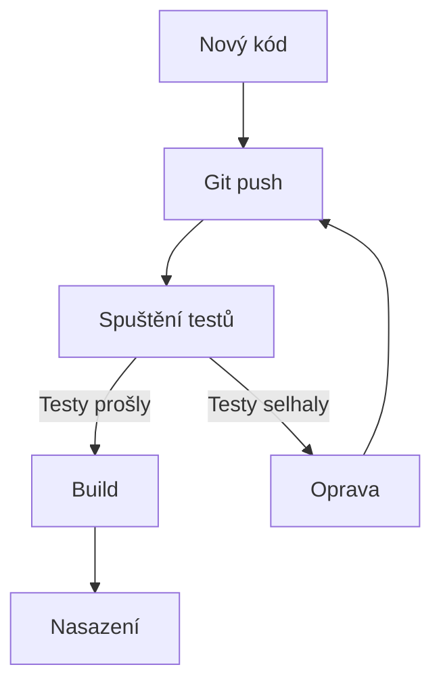
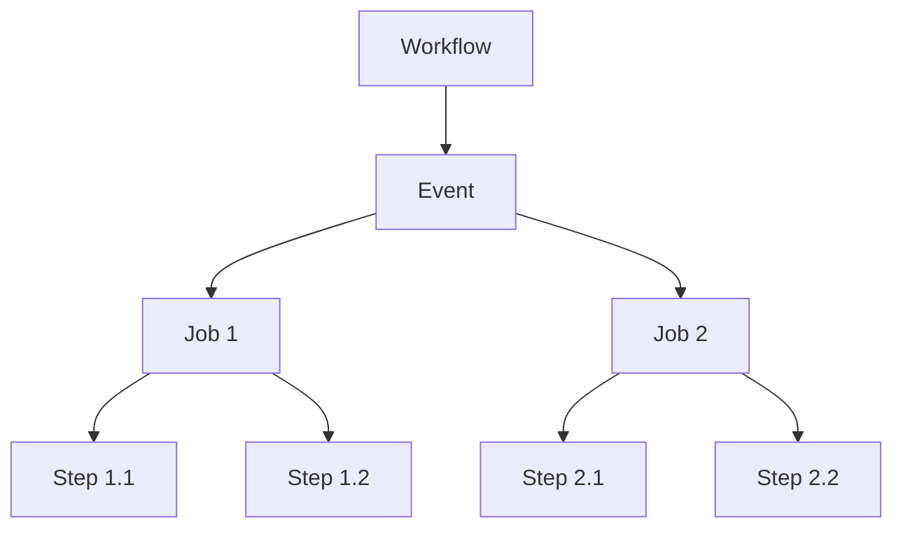
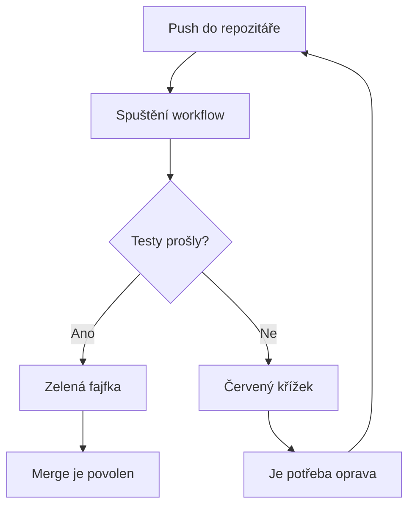

---
#== Layout
theme: default
background: https://cover.sli.dev # https://unsplash.com/collections/94734566/slidev
transition: slide-left #https://sli.dev/guide/animations#slide-transitions
mdc: true # https://sli.dev/guide/syntax#mdc-syntax
selectable: false
codeCopy: false
download: true
hideInToc: true

#== Code Highlighter
highlighter: shiki
lineNumbers: true

#== Dravings https://sli.dev/guide/drawing
drawings:
  persist: false

#== Export Configuration
# use export CLI options in camelCase format https://sli.dev/guide/exporting.html
export:
  format: pdf
  timeout: 30000
  dark: false
  withClicks: false

#== Slide Info
src: '../../pages/index.md'
title: "Testování a CI/CD"
exportFilename: "32_git_actions_testovani"
titleTemplate: "PVA2 %s by Adam Fišer"
info: |
  ## PVA2 Programování a vývoj aplikací

  Určeno pouze pro výukové účely

  [Repository](https://github.com/OA-PVA2-Syllabus/pva2_prednasky) / [Prezentace](https://oa-pva2-syllabus.github.io/pva2_prednasky/)

  Created by [Adam Fišer](https://github.com/AdamFiser)
---
layout: default
---

#  Obsah

<Toc :columns="2" minDepth="1" maxDepth="1"></Toc>
---

# Úvod

- Co je CI/CD?
- Seznámení s GitHub Actions
- Konfigurace GitHub Actions pro pytest
- Praktické ukázky


---

# Co je CI/CD?

<div class="grid grid-cols-2 gap-4">
<div>

## Continuous Integration (CI)
- Automatické testování každé změny
- Rychlá zpětná vazba při vývoji
- Prevence regresí (nových chyb)

## Continuous Delivery (CD)
- Automatické nasazování změn
- Konzistentní proces nasazení
- Méně manuálních chyb

</div>
<div>



</div>
</div>

---

# Seznámení s GitHub Actions

<div class="grid grid-cols-2 gap-4">
<div>

## Co je GitHub Actions?
- Služba pro automatizaci workflow
- Integrovaná přímo v GitHubu
- Konfigurace pomocí YAML souborů
- Spouštění na různých událostech (push, pull request)

## Výhody
- Zdarma pro open-source projekty
- Široká nabídka předpřipravených akcí
- Jednoduchá integrace s GitHub repozitáři

</div>
<div>

```yaml
name: Python tests

on:
  push:
    branches: [ main ]
  pull_request:
    branches: [ main ]

jobs:
  test:
    runs-on: ubuntu-latest
    steps:
    - uses: actions/checkout@v3
    - name: Set up Python
      uses: actions/setup-python@v4
      with:
        python-version: '3.10'
    - name: Run tests
      run: |
        pip install pytest
        python -m pytest
```

</div>
</div>

---

# Základní terminologie GitHub Actions

<div class="grid grid-cols-2 gap-4">
<div>

### Workflow
- Celý automatizovaný proces
- Definovaný v YAML souboru

### Event
- Spouštěcí událost (push, PR, časovač)

### Job
- Jednotlivá práce v rámci workflow
- Běží na vlastním virtuálním stroji

### Step
- Krok v rámci jednoho jobu
- Akce nebo příkaz

</div>
<div>



</div>
</div>

---

# Konfigurace GitHub Actions pro pytest

<div class="grid grid-cols-2 gap-4">
<div>

## Vytvoření workflow souboru
1. Vytvořte adresář `.github/workflows`
2. Vytvořte soubor, např. `pytest.yml`
3. Definujte workflow
4. Push do repozitáře

## Obsah konfigurce
- Událost spuštění
- Virtuální prostředí
- Kroky pro instalaci závislostí
- Krok pro spuštění testů

</div>
<div>

```yaml {*}{maxHeight:'450px'}
name: Python tests

on:
  push:
    branches: [ main ]
  pull_request:
    branches: [ main ]

jobs:
  test:
    runs-on: ubuntu-latest
    steps:
    - uses: actions/checkout@v3
    - name: Set up Python
      uses: actions/setup-python@v4
      with:
        python-version: '3.10'
    - name: Install dependencies
      run: |
        python -m pip install --upgrade pip
        if [ -f requirements.txt ]; then pip install -r requirements.txt; fi
        pip install pytest pytest-cov
    - name: Test with pytest
      run: |
        pytest --cov=./ --cov-report=xml
```

</div>
</div>

---

# První praktická ukázka

Mějme jednoduchý projekt s následující strukturou:

```
my_project/
├── .github/
│   └── workflows/
│       └── pytest.yml
├── src/
│   ├── __init__.py
│   └── calculator.py
├── tests/
│   ├── __init__.py
│   └── test_calculator.py
├── requirements.txt
└── README.md
```

---

---

# Zdrojový kód `calculator.py`

```python
class Calculator:
    def add(self, a, b):
        return a + b
    
    def subtract(self, a, b):
        return a - b
    
    def multiply(self, a, b):
        return a * b
    
    def divide(self, a, b):
        if b == 0:
            raise ValueError("Nelze dělit nulou")
        return a / b
```

---

# Testovací kód `test_calculator.py`

```python
import pytest
from src.calculator import Calculator

def test_add():
    calc = Calculator()
    assert calc.add(1, 2) == 3
    assert calc.add(-1, 1) == 0
    assert calc.add(-1, -1) == -2

def test_subtract():
    calc = Calculator()
    assert calc.subtract(3, 2) == 1
    assert calc.subtract(1, 1) == 0
    assert calc.subtract(-1, -1) == 0

def test_multiply():
    calc = Calculator()
    assert calc.multiply(2, 3) == 6
    assert calc.multiply(-2, 3) == -6
    assert calc.multiply(-2, -3) == 6

def test_divide():
    calc = Calculator()
    assert calc.divide(6, 3) == 2
    assert calc.divide(-6, 3) == -2
    assert calc.divide(-6, -3) == 2
    
def test_divide_by_zero():
    calc = Calculator()
    with pytest.raises(ValueError, match="Nelze dělit nulou"):
        calc.divide(6, 0)
```

---

# GitHub Actions workflow `pytest.yml`

```yaml {*|1|3-7|9-11|9-14|16-19|21-25|27-29|31-37|*}{maxHeight:'450px'}
name: Python tests

on:
  push:
    branches: [ main ]
  pull_request:
    branches: [ main ]

jobs:
  test:
    runs-on: ubuntu-latest
    
    steps:
    - uses: actions/checkout@v3
    
    - name: Set up Python
      uses: actions/setup-python@v4
      with:
        python-version: '3.10'
    
    - name: Install dependencies
      run: |
        python -m pip install --upgrade pip
        pip install pytest pytest-cov
        if [ -f requirements.txt ]; then pip install -r requirements.txt; fi
    
    - name: Test with pytest
      run: |
        pytest --cov=src --cov-report=xml

    # Možné rozšíření
    # codecov - jen pokud máte registraci a propojení
    - name: Upload coverage to Codecov
      uses: codecov/codecov-action@v3
      with:
        file: ./coverage.xml
        fail_ci_if_error: true
```

---

# Co se stane po push do repozitáře?

1. GitHub detekuje nový commit v repozitáři
2. Detekuje konfigurační soubor workflow
3. Spustí virtuální stroj (Ubuntu)
4. Naklonuje repozitář
5. Nainstaluje Python 3.10
6. Nainstaluje závislosti a pytest
7. Spustí testy a vygeneruje report pokrytí
8. Nahraje report pokrytí na službu Codecov (pokud je nastavena)
9. Oznámí výsledky (úspěch/selhání)

---

# Vizualizace výsledků testů

<div class="grid grid-cols-2 gap-4">
<div>

## GitHub zobrazuje výsledky přímo v repozitáři
- Zelená fajfka ✅ = testy prošly
- Červený křížek ❌ = některé testy selhaly
- Žlutý kruh 🟡 = workflow stále běží

## Podrobné výsledky
- Karta "Actions" v repozitáři
- Logy jednotlivých jobů a kroků
- Možnost stažení artefaktů (např. reporty)

</div>
<div>



</div>
</div>

---

# Užitečné zdroje

- [Oficiální dokumentace GitHub Actions](https://docs.github.com/en/actions)
- [Marketplace GitHub Actions](https://github.com/marketplace?type=actions)
- [Pytest dokumentace](https://docs.pytest.org/)
- [Awesome Actions - kolekce užitečných GitHub Actions](https://github.com/sdras/awesome-actions)
- [Codecov - nástroj pro analýzu pokrytí kódu](https://codecov.io/)


---
src: '../../pages/thanku.md'
---